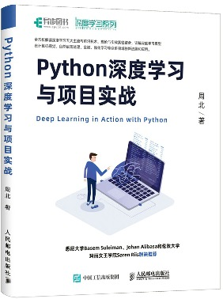

<div align="center">

[English](README.md) · **简体中文**

<br>



# Python 深度学习与项目实战

### Deep Learning in Action with Python · 周北 著

*一本「理论 + 代码」紧密结合、以项目驱动的深度学习实战书 —— 从线性回归一路讲到 GAN 与深度强化学习，每个模型都配有可运行代码。*

<br>


[](https://github.com/sagebei/deep_learning_in_action_with_python/stargazers)

<br>

[](https://item.jd.com/13097524.html)
[](https://product.dangdang.com/29196896.html)
[](https://www.epubit.com/bookDetails?id=UBbf19f26d4bf8)

</div>

<div align="center">

**全书 10 章** · **约 49 个可运行 Notebook** · 计算机视觉 · 自然语言处理 · 金融 · 强化学习

</div>

---

## 📖 关于本书

《**Python 深度学习与项目实战**》由 **人民邮电出版社** 于 2021 年出版，隶属其「**深度学习系列**」。

全书共 **10 章**，由浅入深、**理论与代码紧密结合**，全方位解读深度学习的五大主流与前沿技术，
并将每一项技术应用到 **计算机视觉、自然语言处理、金融、强化学习** 等领域的真实项目中。
全书基于 **Python**、**TensorFlow** 与 **Keras** 实现。

本仓库收录了本书 **全部章节的源代码**：每一个示例与项目都以可直接运行的 **Jupyter Notebook**
形式按章组织。

---

## ✨ 内容亮点

本书带你从基础原理一路走到前沿、研究级别的网络架构：

- 🧱 **基础模型** —— 梯度下降、线性回归与逻辑回归、Softmax 多分类器、全连接神经网络，
  以及训练的基本组件（激活函数、参数初始化、损失函数）。
- 🎛️ **模型优化** —— 防止过拟合、批量标准化、Keras 函数式 API。
- 👁️ **计算机视觉** —— MNIST 与 CIFAR-10 图像分类、猫狗分类项目、经典 CNN 架构、**迁移学习**。
- 💬 **自然语言处理** —— 分词、词向量（含**中文词向量**）、RNN / LSTM / GRU、双向 LSTM、
  **注意力机制**、**ELMo**、文本生成。
- 💳 **金融应用** —— 信用卡欺诈交易检测、基于 LSTM 的**股价预测**。
- 🎨 **生成与强化学习** —— 自编码器、**对抗神经网络（GAN）**，以及 **DQN**、**Policy Gradient**、
  **Actor-Critic** 等深度强化学习算法。

---

## 🗂️ 书籍目录

| # | 章节 | 实战要点 | 代码 |
|:--:|:--|:--|:--:|
| 01 | **线性回归模型** | 梯度下降算法 · 波士顿房价数据集 | [📁 代码](%E3%80%8APython%E6%B7%B1%E5%BA%A6%E5%AD%A6%E4%B9%A0%E4%B8%8E%E9%A1%B9%E7%9B%AE%E5%AE%9E%E6%88%98%E3%80%8B%E5%90%84%E7%AB%A0%E8%8A%82%E4%BB%A3%E7%A0%81/%E7%AC%AC1%E7%AB%A0) |
| 02 | **逻辑回归模型** | 二分类项目实战 | [📁 代码](%E3%80%8APython%E6%B7%B1%E5%BA%A6%E5%AD%A6%E4%B9%A0%E4%B8%8E%E9%A1%B9%E7%9B%AE%E5%AE%9E%E6%88%98%E3%80%8B%E5%90%84%E7%AB%A0%E8%8A%82%E4%BB%A3%E7%A0%81/%E7%AC%AC2%E7%AB%A0) |
| 03 | **Softmax 多分类器** | 多分类 · 数据集预处理 | [📁 代码](%E3%80%8APython%E6%B7%B1%E5%BA%A6%E5%AD%A6%E4%B9%A0%E4%B8%8E%E9%A1%B9%E7%9B%AE%E5%AE%9E%E6%88%98%E3%80%8B%E5%90%84%E7%AB%A0%E8%8A%82%E4%BB%A3%E7%A0%81/%E7%AC%AC3%E7%AB%A0) |
| 04 | **全连接神经网络** | 激活函数 · 参数初始化 · 损失函数 · MNIST | [📁 代码](%E3%80%8APython%E6%B7%B1%E5%BA%A6%E5%AD%A6%E4%B9%A0%E4%B8%8E%E9%A1%B9%E7%9B%AE%E5%AE%9E%E6%88%98%E3%80%8B%E5%90%84%E7%AB%A0%E8%8A%82%E4%BB%A3%E7%A0%81/%E7%AC%AC4%E7%AB%A0) |
| 05 | **神经网络模型的优化** | 防止过拟合 · 批量标准化 · 函数式 API · CIFAR-10 | [📁 代码](%E3%80%8APython%E6%B7%B1%E5%BA%A6%E5%AD%A6%E4%B9%A0%E4%B8%8E%E9%A1%B9%E7%9B%AE%E5%AE%9E%E6%88%98%E3%80%8B%E5%90%84%E7%AB%A0%E8%8A%82%E4%BB%A3%E7%A0%81/%E7%AC%AC5%E7%AB%A0) |
| 06 | **卷积神经网络** | 卷积/池化层 · 猫狗分类 · 经典 CNN · 迁移学习 | [📁 代码](%E3%80%8APython%E6%B7%B1%E5%BA%A6%E5%AD%A6%E4%B9%A0%E4%B8%8E%E9%A1%B9%E7%9B%AE%E5%AE%9E%E6%88%98%E3%80%8B%E5%90%84%E7%AB%A0%E8%8A%82%E4%BB%A3%E7%A0%81/%E7%AC%AC6%E7%AB%A0) |
| 07 | **循环神经网络** | 词向量 · LSTM / GRU · 双向 LSTM · 注意力 · ELMo · 文本生成 · 股价预测 | [📁 代码](%E3%80%8APython%E6%B7%B1%E5%BA%A6%E5%AD%A6%E4%B9%A0%E4%B8%8E%E9%A1%B9%E7%9B%AE%E5%AE%9E%E6%88%98%E3%80%8B%E5%90%84%E7%AB%A0%E8%8A%82%E4%BB%A3%E7%A0%81/%E7%AC%AC7%E7%AB%A0) |
| 08 | **自编码模型** | 降维 · 信用卡欺诈检测 · 反卷积 · 图片去噪 | [📁 代码](%E3%80%8APython%E6%B7%B1%E5%BA%A6%E5%AD%A6%E4%B9%A0%E4%B8%8E%E9%A1%B9%E7%9B%AE%E5%AE%9E%E6%88%98%E3%80%8B%E5%90%84%E7%AB%A0%E8%8A%82%E4%BB%A3%E7%A0%81/%E7%AC%AC8%E7%AB%A0) |
| 09 | **对抗神经网络** | GAN 图像生成 | [📁 代码](%E3%80%8APython%E6%B7%B1%E5%BA%A6%E5%AD%A6%E4%B9%A0%E4%B8%8E%E9%A1%B9%E7%9B%AE%E5%AE%9E%E6%88%98%E3%80%8B%E5%90%84%E7%AB%A0%E8%8A%82%E4%BB%A3%E7%A0%81/%E7%AC%AC9%E7%AB%A0) |
| 10 | **深度强化学习** | DQN · Policy Gradient · Actor-Critic | [📁 代码](%E3%80%8APython%E6%B7%B1%E5%BA%A6%E5%AD%A6%E4%B9%A0%E4%B8%8E%E9%A1%B9%E7%9B%AE%E5%AE%9E%E6%88%98%E3%80%8B%E5%90%84%E7%AB%A0%E8%8A%82%E4%BB%A3%E7%A0%81/%E7%AC%AC10%E7%AB%A0) |

---

## 🛠️ 技术栈

<p>


</p>

---

## 🚀 快速开始

所有代码均为 `.ipynb` 文件，推荐使用 **Jupyter Notebook** 或 **JupyterLab** 打开、编辑、运行。

```bash
# 1. 克隆仓库
git clone https://github.com/sagebei/deep_learning_in_action_with_python.git
cd deep_learning_in_action_with_python

# 2. 安装核心依赖
pip install tensorflow keras jupyter numpy pandas matplotlib scikit-learn

# 3. 启动 Jupyter，打开任意章节
jupyter notebook
```

> 💡 **数据集** 均从本地目录加载。请读者根据数据集保存的位置，自行调整代码中的加载路径，以确保代码顺利运行。

---

## 🛒 购买与阅读

**📦 纸质版**

- [京东](https://item.jd.com/13097524.html)
- [当当网](https://product.dangdang.com/29196896.html)
- [异步社区（出版社官方）](https://www.epubit.com/bookDetails?id=UBbf19f26d4bf8)

**📱 电子书 / 在线阅读**

- [Amazon Kindle](https://www.amazon.com/-/zh_TW/%E5%91%A8%E5%8C%97%E8%91%97-ebook/dp/B09V14YF11)
- [Apple Books](https://books.apple.com/gb/book/python%E6%B7%B1%E5%BA%A6%E5%AD%A6%E4%B9%A0%E4%B8%8E%E9%A1%B9%E7%9B%AE%E5%AE%9E%E6%88%98/id1622929269)
- [得到](https://www.dedao.cn/ebook/detail?id=DGgybmrKYXmzPQ5bgJEjMdeOxDlyn0M8jG6w2GaRN8k4p6B1oArL9Z7qvVRp8O12)
- [京东读书](https://cread.jd.com/read/startRead.action?bookId=30702274&readType=1)
- [QQ 阅读](https://book.qq.com/book-detail/36160647)
- [起点中文网](https://book.qidian.com/info/1026160648/)

---

## ✍️ 作者

周北（Bei Zhou）著 · [github.com/sagebei](https://github.com/sagebei)

如有任何问题，欢迎与作者联系。

---

<div align="center">

如果本仓库或本书对你有帮助，欢迎点亮 ⭐ Star —— 也能帮助更多人发现它。

<sub>© 2021 周北 · 人民邮电出版社出版 · ISBN 978-7-115-55083-5。<br>
本仓库代码供本书读者学习使用。</sub>

</div>
